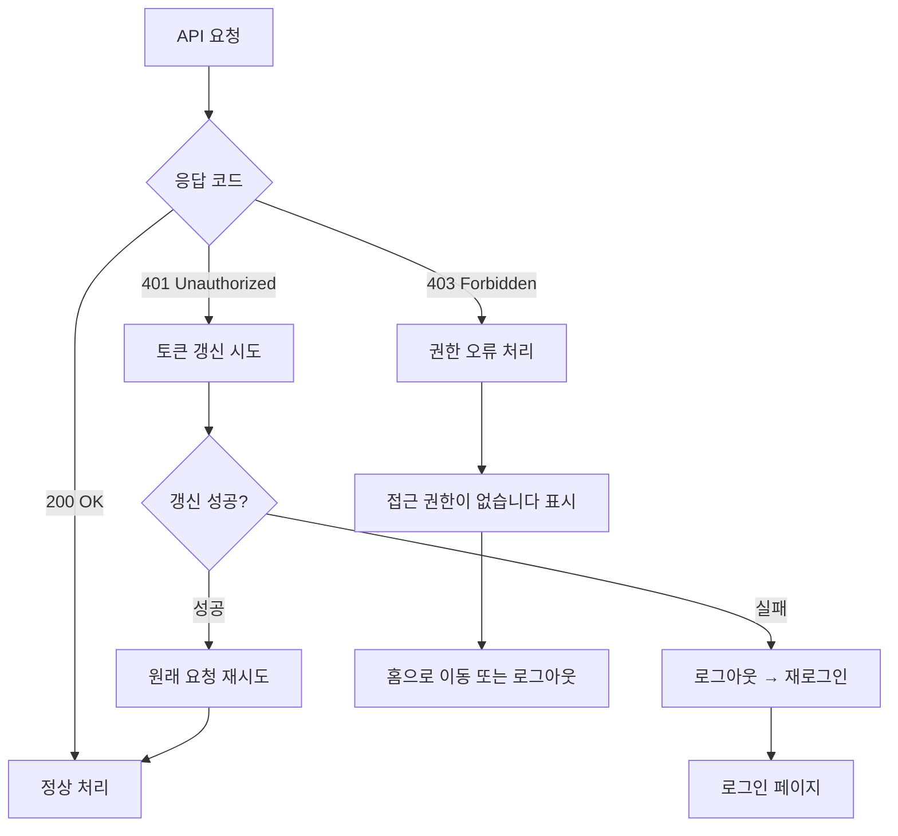

> **📄 이 문서는 무엇인가요?**
> - **한 줄 요약**: 세일즈PT 영업일지 앱의 예외 상황과 엣지케이스별 대응 방안 명세
> - **누가 읽나요**: 개발자, QA 테스터, 기획자
> - **어떤 기능·작업과 연결?**: 에러 처리 구현, 사용자 경험 개선, 버그 픽스
> - **읽고 나면 알 수 있는 것**:
>   - 각 상황별 시스템 대응 방법
>   - API 에러 코드와 UX 처리 방안
>   - 사용자에게 표시할 에러 메시지
> - **관련 문서**: [사용자 여정](./user-journeys.md), [API 명세](./api-spec.md), [상태 전이도](./state-machines.md)

# 엣지케이스 및 예외 처리

## 엣지케이스 대응 표

| # | 카테고리 | 상황 | 기대 동작 | API 응답 코드 | UX 대응 | 복구 방안 |
|---|----------|------|-----------|---------------|---------|-----------|
| 1 | **데이터 검증** | 컨택성공 > 컨택진행 | 저장 버튼 비활성화 + 경고 표시 | - (클라이언트 검증) | 🔴 "컨택성공이 컨택진행보다 많을 수 없습니다" | 사용자가 수치 조정 |
| 2 | **네트워크** | 시트 쓰기 중 네트워크 끊김 | 3회 재시도 후 실패 토스트 | 5xx, timeout | 🔴 "인터넷 연결을 확인해주세요" + [재시도] 버튼 | localStorage에 임시저장 → 재연결 시 복구 제안 |
| 3 | **동시성** | 다른 탭에서 같은 날짜 수정 | 저장 시 충돌 감지 | 409 Conflict | 🟡 "다른 곳에서 수정된 데이터가 있습니다. 새로고침하시겠습니까?" | 사용자 선택: 덮어쓰기 vs 새로고침 |
| 4 | **권한** | 타 수강생 시트 접근 시도 | 403 차단 + 권한 에러 | 403 Forbidden | 🔴 "접근 권한이 없습니다" | 로그아웃 → 재로그인 유도 |
| 5 | **기간 제한** | 수강 시작 전 날짜 진입 | 입력 필드 비활성화 | - (클라이언트 체크) | 🟡 "수강 시작 전입니다 (시작일: 시트 N1 동적 계산)" 배너 | 날짜 네비로 수강 기간 내 이동 |
| 6 | **기간 제한** | 수강 중 (1~8주) 접근 | 모든 기능 완전 활성 | - (정상 동작) | 정상 UI, 파란색 주차 표시 | 모든 편집 가능 |
| 7 | **기간 제한** | 마감 유예 (9~10주) 접근 | 미팅/계약/수납 편집 가능 | - (클라이언트 체크) | 🟡 "📌 마감 유예 기간" 앰버색 배지 | 제한적 편집, 별도 집계 |
| 8 | **기간 제한** | 완전 종료 (11주~) 접근 | 완전 읽기 전용 모드 | - (클라이언트 체크) | 🟡 "수강 완료, 기록 종료 🎉" 회색 배너 | 데이터 조회만 가능 |
| 9 | **오프라인** | 네트워크 완전 끊김 | localStorage 임시저장 + 재연결 시 동기화 | - (네트워크 없음) | 🟡 "오프라인 모드입니다" + 📡 재연결 대기 | 자동 재연결 감지 → 동기화 제안 |
| 10 | **논리 검증** | 미팅 수 불일치 (컨택성공=3, 슬롯 2개) | 저장 시 확인 모달 | - (클라이언트 체크) | 🟡 "컨택성공보다 미팅이 적습니다. 저장하시겠습니까?" | 사용자 확인 후 저장 허용 |
| 11 | **필수값** | 계약=true인데 수임비=0 | 저장 불가 + 포커스 이동 | - (클라이언트 검증) | 🔴 "계약 시 수임비를 입력해주세요" | 수임비 필드로 자동 포커스 |
| 12 | **중복 감지** | 같은 업체·금액·날짜 DB주문 | 확인 모달 표시 | 409 Conflict | 🟡 "중복 주문입니다. 계속하시겠습니까?" | 사용자 선택: 계속 vs 취소 |

---

## 세부 엣지케이스 시나리오

### 1. 데이터 검증 실패 (클라이언트 사이드)

**상황**: 사용자가 논리적으로 불가능한 값 입력
- 컨택성공(5) > 컨택진행(3)
- 수납건수(3) > 승인건수(2)
- 음수 값 입력 (-5생산)

**대응 전략**:
```javascript
// 실시간 검증
function validateChannelData(channel) {
  const errors = [];
  
  if (channel.컨택성공 > channel.컨택진행) {
    errors.push("컨택성공이 컨택진행보다 많을 수 없습니다");
  }
  if (channel.컨택진행 > channel.유입) {
    errors.push("컨택진행이 유입보다 많을 수 없습니다");
  }
  if (channel.유입 > channel.생산) {
    errors.push("유입이 생산보다 많을 수 없습니다");
  }
  
  return errors;
}
```

**UX 처리**:
- 에러 필드 빨간색 테두리
- 저장 버튼 비활성화
- 구체적 에러 메시지 표시
- 올바른 값 입력 시 즉시 해제

---

### 2. 네트워크 오류 (서버 통신 실패)

**상황 분류**:
- **일시적 장애**: 서버 과부하, DNS 이슈
- **영구적 장애**: API 서버 다운, 인증 만료
- **Google Sheets API 할당량 초과**: 429 Too Many Requests

**대응 로직**:
```javascript
async function saveWithRetry(data, maxRetries = 3) {
  let attempts = 0;
  
  while (attempts < maxRetries) {
    try {
      const response = await api.saveDailyEntry(data);
      return response; // 성공 시 즉시 반환
      
    } catch (error) {
      attempts++;
      
      if (error.status === 401) {
        // 인증 만료 → 즉시 재로그인
        redirectToLogin();
        return;
      }
      
      if (error.status === 429) {
        // 할당량 초과 → 지수 백오프
        await sleep(Math.pow(2, attempts) * 1000);
      }
      
      if (attempts >= maxRetries) {
        // 최종 실패 → localStorage 백업
        saveToLocalStorage(data);
        throw new Error("저장에 실패했습니다. 데이터는 임시저장되었습니다.");
      }
    }
  }
}
```

**UX 처리**:
- 재시도 중: 스피너 + "저장 중..." 메시지
- 실패 시: "저장 실패. 인터넷 연결을 확인해주세요" + [재시도] 버튼
- 임시저장: "데이터가 임시저장되었습니다. 연결 복구 시 다시 시도해주세요"

---

### 3. 동시성 충돌 (여러 탭/기기에서 접근)

**상황**: 
- 동일 사용자가 PC/모바일에서 동시 접근
- 같은 날짜 데이터를 다른 탭에서 수정

**충돌 감지 방법**:
- Google Sheets 셀에 `lastModified` 타임스탬프 추가
- 저장 시 현재 타임스탬프와 비교
- 불일치 시 409 Conflict 응답

**해결 전략**:
```javascript
// 저장 전 충돌 체크
async function saveWithConflictCheck(date, data) {
  const currentData = await api.getDailyEntry(date);
  
  if (currentData.lastModified > data.lastModified) {
    // 충돌 감지
    const userChoice = await showConflictModal({
      current: data,
      server: currentData
    });
    
    if (userChoice === 'overwrite') {
      return api.saveDailyEntry(data, { force: true });
    } else {
      return api.getDailyEntry(date); // 서버 데이터로 리프레시
    }
  }
  
  return api.saveDailyEntry(data);
}
```

**UX 처리**:
- 충돌 모달: 현재 입력값 vs 서버 데이터 비교 표시
- 선택지: "덮어쓰기" / "서버 데이터로 새로고침"
- 중요 데이터는 사용자 확인 필수

---

### 4. 권한 및 인증 오류

**상황 분류**:
- **세션 만료**: 토큰 유효기간 초과 (1시간)
- **권한 부족**: 다른 수강생 시트 접근 시도
- **계정 상태**: 수강 취소, 계정 비활성화

**대응 흐름**:


**UX 처리**:
- 401: 자동 토큰 갱신 (사용자 인지 불가)
- 403: "접근 권한이 없습니다" + 홈 버튼
- 갱신 실패: "다시 로그인해주세요" + 로그인 버튼

---

### 5. 기간 제한 (수강 전/중/유예/후)

**동적 기간 계산**:
```javascript
function calculateCoursePeriods(courseStartDate) {
  const startDate = new Date(courseStartDate); // 시트 N1에서 읽기
  const courseEndDate = new Date(startDate.getTime() + (55 * 24 * 60 * 60 * 1000)); // +55일
  const editEndDate = new Date(startDate.getTime() + (69 * 24 * 60 * 60 * 1000)); // +69일
  
  return {
    courseStart: startDate,
    courseEnd: courseEndDate,
    editEnd: editEndDate
  };
}

function validateAccessDate(targetDate, periods) {
  const target = new Date(targetDate);
  
  if (target < periods.courseStart) {
    return {
      valid: false,
      type: 'before_course',
      message: `수강 시작 전입니다 (시작일: ${formatDate(periods.courseStart)})`,
      action: 'readonly_with_banner',
      color: 'amber'
    };
  }
  
  if (target <= periods.courseEnd) {
    const weekNumber = Math.floor((target - periods.courseStart) / (7 * 24 * 60 * 60 * 1000)) + 1;
    return {
      valid: true,
      type: 'course_period',
      weekNumber,
      message: `${weekNumber}주차`,
      action: 'full_edit',
      color: 'blue'
    };
  }
  
  if (target <= periods.editEnd) {
    const daysSinceEnd = Math.floor((target - periods.courseEnd) / (24 * 60 * 60 * 1000));
    return {
      valid: true,
      type: 'grace_period',
      message: `📌 마감 유예 ${daysSinceEnd}일째`,
      action: 'limited_edit',
      color: 'amber'
    };
  }
  
  return {
    valid: false,
    type: 'archived',
    message: `수강 완료, 기록 종료 🎉`,
    action: 'readonly_archived',
    color: 'gray'
  };
}
```

**각 기간별 UX 처리**:

1. **수강 시작 전**: 
   - 모든 입력 필드 비활성화
   - 앰버색 배너: "수강 시작 전입니다"
   - 데이터 조회만 허용

2. **수강 기간 (1~8주)**:
   - 모든 기능 완전 활성화
   - 파란색 주차 배지 표시
   - 정상 통계 집계

3. **마감 유예 (9~10주)**:
   - 미팅/계약/수납 탭만 편집 가능
   - 앰버색 "📌 마감 유예" 배지
   - 별도 집계 영역에 표시
   - 주차 네비에서 별도 섹션

4. **완전 종료 (11주~)**:
   - 모든 입력 완전 비활성화
   - 회색 "수강 완료" 배너
   - 읽기 전용 모드, 과거 데이터만 조회

---

### 6. 오프라인 모드

**오프라인 감지**:
```javascript
// 네트워크 상태 모니터링
window.addEventListener('online', handleOnline);
window.addEventListener('offline', handleOffline);

function handleOffline() {
  showOfflineBanner();
  enableOfflineMode();
}

function handleOnline() {
  hideOfflineBanner();
  syncPendingData();
}
```

**임시저장 전략**:
- LocalStorage에 입력 데이터 저장
- 타임스탬프와 함께 큐 형태로 관리
- 재연결 시 순차적으로 서버 동기화
- 동기화 실패 시 사용자에게 수동 재시도 옵션

**UX 처리**:
- 상단 배너: "오프라인 모드 📡 재연결 대기 중"
- 입력 허용하되 "임시저장됨" 표시
- 재연결 시 "동기화 중..." → "동기화 완료 ✅"

---

### 7. 미팅 관련 특수 케이스

**Google Calendar 동기화 실패**:
```javascript
async function createMeetingWithCalendar(meetingData) {
  let meetingId;
  
  try {
    // 1. 시트에 미팅 저장 (SSOT 우선)
    meetingId = await api.createMeeting(meetingData);
    
    // 2. 캘린더 이벤트 생성 시도
    const calendarEventId = await calendar.createEvent(meetingData);
    
    // 3. 이벤트 ID를 시트에 저장
    await api.updateMeetingCalendarId(meetingId, calendarEventId);
    
  } catch (calendarError) {
    // 시트 저장은 성공, 캘린더만 실패
    showWarningToast("미팅은 저장되었으나 캘린더 동기화에 실패했습니다 ⚠️");
    return meetingId;
  }
}
```

**미팅 수 불일치**:
- 컨택성공 3건인데 미팅 슬롯 1개만 채움
- 경고 표시하되 저장 허용 (실제 상황에서 가능)
- "컨택성공보다 미팅이 적습니다. 추가 미팅을 예약하시겠습니까?"

---

### 8. DB 주문 관련 엣지케이스

**재고 부족 (백엔드 처리)**:
- 주문 시점에는 "입력" 상태로 저장
- 관리자가 재고 확인 후 "확정" 또는 "취소"
- 취소 시 사용자에게 푸시 알림 (Phase 2)

**중복 주문 감지**:
```javascript
function detectDuplicateOrder(newOrder, existingOrders) {
  const duplicates = existingOrders.filter(order => 
    order.channel === newOrder.channel &&
    order.quantity === newOrder.quantity &&
    order.date === newOrder.date &&
    order.status !== '취소'
  );
  
  return duplicates.length > 0;
}
```

---

## UX 대응 원칙 및 가이드라인

### 1. 에러 메시지 톤앤매너
- ❌ 기술적 용어: "HTTP 500 Internal Server Error"
- ✅ 사용자 친화적: "일시적 문제가 발생했습니다. 잠시 후 다시 시도해주세요"
- ❌ 책임 전가: "잘못된 입력입니다"
- ✅ 건설적 안내: "컨택성공이 컨택진행보다 많을 수 없습니다. 수치를 확인해주세요"

### 2. 복구 액션 제공
모든 에러 상황에서 사용자가 할 수 있는 다음 액션 제시:
- **[재시도]** 버튼 (네트워크 오류)
- **[수정하기]** 버튼 (검증 오류)
- **[새로고침]** 버튼 (충돌 상황)
- **[로그인]** 버튼 (인증 오류)

### 3. 상태별 색상 코드
- 🔴 **빨간색**: 치명적 오류, 즉시 해결 필요
- 🟡 **노란색**: 경고, 주의 필요하나 진행 가능
- 🔵 **파란색**: 정보 제공, 중성적 안내
- 🟢 **초록색**: 성공, 정상 상태

### 4. 진행률 및 피드백
- 긴 작업: 프로그레스 바 또는 스피너
- 짧은 작업: 즉시 피드백 (버튼 색상 변경, 체크마크)
- 백그라운드 작업: 토스트 메시지
- 중요한 상태 변경: 모달 또는 페이지 전환

이러한 엣지케이스 처리를 통해 사용자는 어떤 상황에서도 당황하지 않고 앱을 계속 사용할 수 있으며, 데이터 손실을 최소화할 수 있습니다.