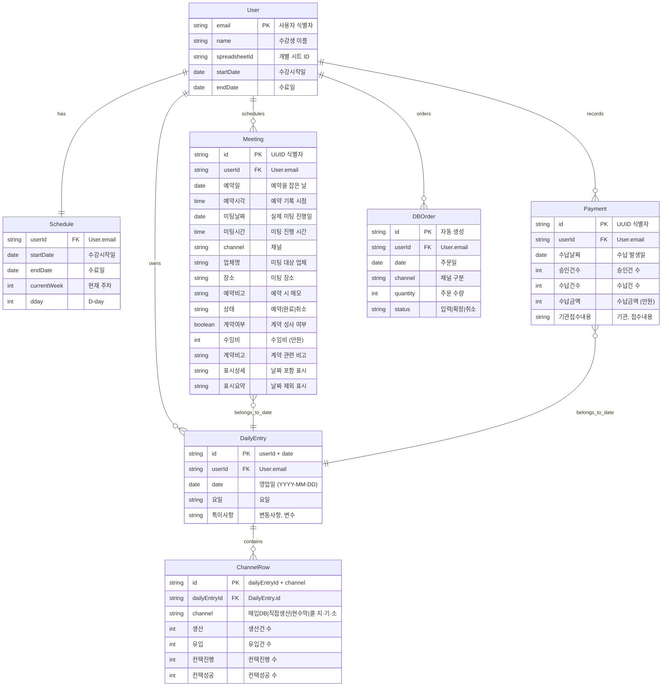

> **📄 이 문서는 무엇인가요?**
> - **한 줄 요약**: 세일즈PT 영업일지 시스템의 엔티티 관계도와 Google Sheets 매핑 설명
> - **누가 읽나요**: 개발자
> - **어떤 기능·작업과 연결?**: 데이터 모델 설계, API 구현, Google Sheets 연동
> - **읽고 나면 알 수 있는 것**:
>   - 시스템의 핵심 엔티티와 관계 구조
>   - 각 엔티티가 Google Sheets의 어떤 탭/컬럼에 매핑되는지
> - **관련 문서**: [데이터 모델](./data-model.md), [상태 전이도](./state-machines.md), [API 명세](./api-spec.md)

# ER 다이어그램

## 엔티티 관계도

## Google Sheets 매핑

### 대시보드 탭 (읽기 전용)
- 1-6행: 자동 계산된 요약 데이터
- SUM, 효율 계산 수식으로 영업관리 탭 참조

### 영업관리 탭 (생산 입력 + 수식 집계)
- **DailyEntry**: 하루 = 4행 (채널별), 날짜는 A-C열
- **ChannelRow**: D열(채널), E-H열(생산/유입/컨택진행/컨택성공) ← **웹 직접 쓰기**
- **Meeting 집계**: I-L열 ← **업체관리 탭 수식** (TEXTJOIN, COUNTIFS)
- **Payment 집계**: Q-T열 ← **수납관리 탭 수식** (SUMIFS)
- **특이사항**: M열 ← **웹 직접 쓰기**

### 업체관리 탭 (신설) 🆕
- **Meeting**: 1행 = 1미팅
- A열: id (UUID), B열: 예약일, C열: 예약시각
- D열: 미팅날짜, E열: 미팅시간, F열: 채널
- G열: 업체명, H열: 장소, I열: 예약비고
- J열: 상태, K열: 계약여부, L열: 수임비, M열: 계약비고
- **N열: 표시_상세** (수식), **O열: 표시_요약** (수식)

### 수납관리 탭 (신설) 🆕
- **Payment**: 1행 = 1수납 기록
- A열: id (UUID), B열: 수납날짜
- C열: 승인건수, D열: 수납건수, E열: 수납금액, F열: 기관접수내용

### 회고노트 탭 (기존 유지)
- 자유 텍스트 입력

### 마스터 레지스트리 시트
- **User**: email → spreadsheetId 매핑
- 수강생별 개별 시트 관리

## 데이터 흐름 특징

1. **단일 진실 출처**: Google Sheets가 유일한 데이터베이스
2. **계층적 수식 집계**: 업체관리/수납관리 → (수식) → 영업관리 → (수식) → 대시보드
3. **쓰기 제한**: 웹은 업체관리/수납관리/영업관리(E~H,M)만 직접 쓰기
4. **1엔티티=1행**: Meeting, Payment는 정규화된 행 단위 저장
5. **예약일 vs 미팅날짜**: 생산 지표(예약일) ≠ 컨택 지표(미팅날짜) 분리
6. **사용자별 격리**: 수강생마다 개별 spreadsheetId로 데이터 분리