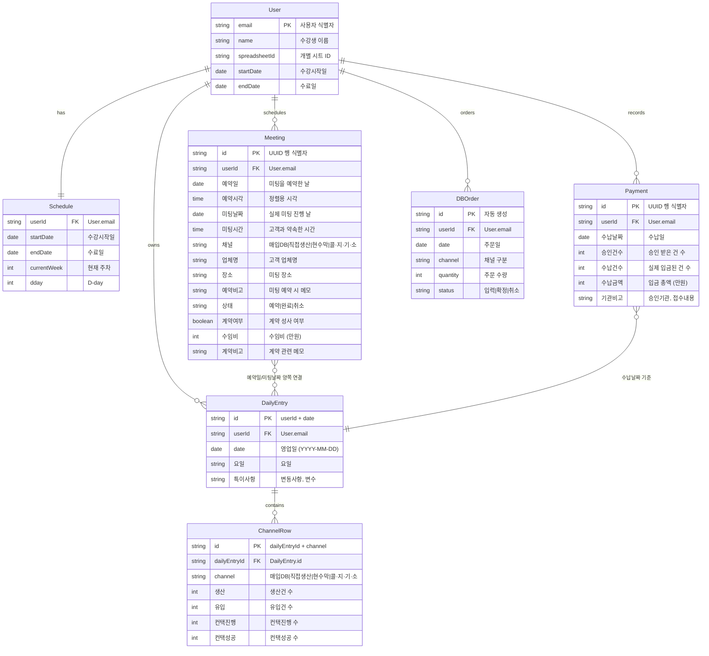

> **📄 이 문서는 무엇인가요?**
> - **한 줄 요약**: 세일즈PT 영업일지 시스템의 엔티티 관계도와 Google Sheets 매핑 설명
> - **누가 읽나요**: 개발자
> - **어떤 기능·작업과 연결?**: 데이터 모델 설계, API 구현, Google Sheets 연동
> - **읽고 나면 알 수 있는 것**:
>   - 시스템의 핵심 엔티티와 관계 구조
>   - 각 엔티티가 Google Sheets의 어떤 탭/컬럼에 매핑되는지
> - **관련 문서**: [데이터 모델](./data-model.md), [상태 전이도](./state-machines.md), [API 명세](./api-spec.md)

# ER 다이어그램

## 엔티티 관계도



## Google Sheets 매핑 (ADR-0003 업데이트)

### 새로운 4탭 구조

#### 1. 대시보드 탭 (읽기 전용)
- 자동 계산된 요약 데이터, 차트
- 영업관리 탭의 수식을 참조하여 생성

#### 2. 업체관리 탭 (신규, Meeting 엔티티 SSOT)
- **Meeting**: A~M열 전체 필드 매핑
- 각 행 = Meeting 1건 (1미팅 = 1행 정규화)
- A(id), B(예약일), C(예약시각), D(미팅날짜), E(미팅시간), F(채널), G(업체명), H(장소), I(예약비고), J(상태), K(계약여부), L(수임비), M(계약비고)

#### 3. 수납관리 탭 (신규, Payment 엔티티 독립 관리)
- **Payment**: A~F열 전체 필드 매핑  
- 각 행 = 1일 수납 기록
- A(id), B(수납날짜), C(승인건수), D(수납건수), E(수납금액), F(기관비고)

#### 4. 영업관리 탭 (집계 뷰로 역할 변경)
- **DailyEntry**: 하루 = 4행 (채널별), B~T열
- **ChannelRow**: E~H열(생산/유입/컨택진행/컨택성공) - 웹 직접 입력
- **Meeting 집계**: I~L, N~P열 - 업체관리 탭 → 시트 수식 자동
- **Payment 집계**: Q~T열 - 수납관리 탭 → 시트 수식 자동
- **특이사항**: M열 - 웹 직접 입력

### 데이터 흐름
```
업체관리 탭 (Meeting 원본) ↘
                          → 영업관리 탭 (집계 뷰) → 대시보드 탭
수납관리 탭 (Payment 원본) ↗
```

### 마스터 레지스트리 시트 (기존 유지)
- **User**: email → spreadsheetId 매핑
- 수강생별 개별 시트 관리

## 데이터 흐름 특징 (ADR-0003 업데이트)

1. **단일 진실 출처**: Google Sheets가 유일한 데이터베이스
2. **데이터 정규화**: Meeting과 Payment를 별도 탭으로 분리 (1행 = 1엔티티)
3. **시트 수식 활용**: 업체관리/수납관리 → 영업관리 자동 집계
4. **독립적 관계**: Meeting과 Payment는 서로 독립 (외래키 없음)
5. **이중 날짜 매핑**: Meeting은 예약일과 미팅날짜 양쪽에서 DailyEntry와 연결
6. **읽기/쓰기 분리**: 
   - 웹 직접 쓰기: 업체관리, 수납관리, 영업관리 E~H/M
   - 시트 수식 자동: 영업관리 I~L/N~T, 대시보드
7. **사용자별 격리**: 수강생마다 개별 spreadsheetId로 데이터 분리