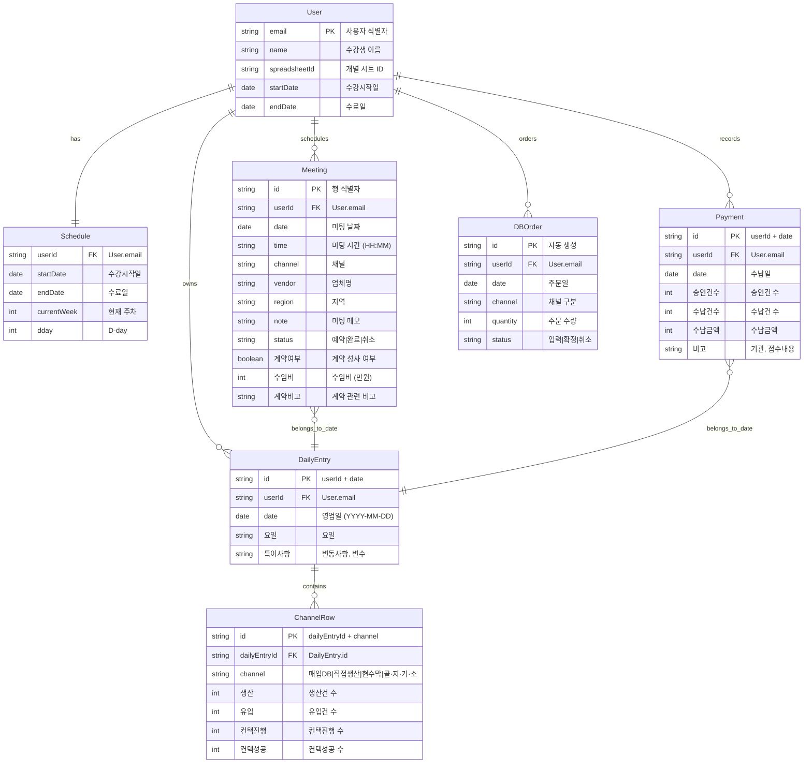

> **📄 이 문서는 무엇인가요?**
> - **한 줄 요약**: 세일즈PT 영업일지 시스템의 엔티티 관계도와 Google Sheets 매핑 설명
> - **누가 읽나요**: 개발자
> - **어떤 기능·작업과 연결?**: 데이터 모델 설계, API 구현, Google Sheets 연동
> - **읽고 나면 알 수 있는 것**:
>   - 시스템의 핵심 엔티티와 관계 구조
>   - 각 엔티티가 Google Sheets의 어떤 탭/컬럼에 매핑되는지
> - **관련 문서**: [데이터 모델](./data-model.md), [상태 전이도](./state-machines.md), [API 명세](./api-spec.md)

# ER 다이어그램

## 엔티티 관계도

## Google Sheets 매핑

### 01 영업관리 탭
- **DailyEntry**: 하루 = 4행 (채널별), 날짜는 B-C열
- **ChannelRow**: D열(채널), E-H열(생산/유입/컨택진행/컨택성공)
- **Meeting 요약**: I열 (미팅예약 기록, TEXTJOIN으로 집계)
- **일정·계약관리**: J-P열 (미팅일정/완료수/특이사항/계약건수/수임비/비고)
- **Payment**: Q-T열 (승인/수납건수/금액/비고)

### 앱_미팅예약 탭
- **Meeting**: 전체 필드 매핑
- 각 행 = Meeting 1건
- A열부터 순차적으로 date, time, channel, vendor, region, note, status, 계약여부, 수임비, 계약비고

### 대시보드 탭 (읽기 전용)
- 1-6행: 자동 계산된 요약 데이터
- SUM, 효율 계산 수식으로 01 영업관리 탭 참조

### DB관리 탭
- **DBOrder**: A열부터 date, channel, quantity, status
- 채널별 효율성 지표는 01 영업관리 탭에서 자동 계산

### 마스터 레지스트리 시트
- **User**: email → spreadsheetId 매핑
- 수강생별 개별 시트 관리

## 데이터 흐름 특징

1. **단일 진실 출처**: Google Sheets가 유일한 데이터베이스
2. **시트 간 연동**: 수식을 통한 자동 집계 (TEXTJOIN, SUM 등)
3. **읽기/쓰기 분리**: 대시보드/DB관리는 읽기 전용, 나머지는 입력 가능
4. **사용자별 격리**: 수강생마다 개별 spreadsheetId로 데이터 분리