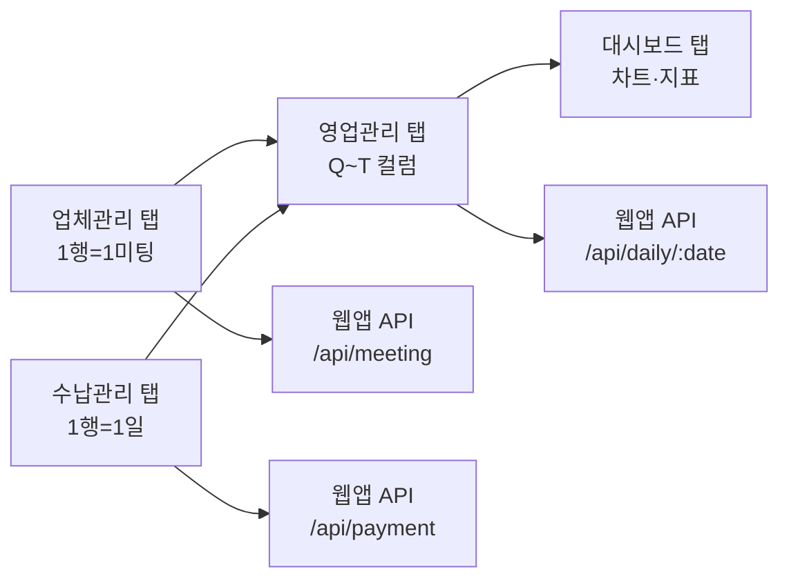

> **📄 이 문서는 무엇인가요?**
> - **한 줄 요약**: Google Sheets 4개 탭의 상세 컬럼 정의와 웹 쓰기/시트 수식 구분
> - **누가 읽나요**: 개발자, API 구현자
> - **어떤 기능·작업과 연결?**: Sheets API 연동, 백엔드 모델 매핑, 프론트엔드 폼 설계
> - **읽고 나면 알 수 있는 것**:
>   - 각 탭의 정확한 컬럼 구조 (A~Z)
>   - 웹앱이 직접 쓰는 컬럼 vs 시트 수식으로 계산되는 컬럼
>   - 실제 데이터 예시와 수식 패턴
> - **관련 문서**: [ADR-0003](../decisions/0003-company-tab-split.md), [데이터 모델](./data-model.md), [API 명세](./api-spec.md)

# Google Sheets 구조 — 4개 탭 상세 명세

## 전체 구조 개요

```
📊 개별 수강생 시트 (spreadsheet)
├── 01 대시보드    (읽기 전용, 시트 수식)
├── 02 업체관리    (웹 쓰기, 1행=1미팅) ⭐ 신규
├── 03 수납관리    (웹 쓰기, 1행=1일)   ⭐ 신규  
└── 04 영업관리    (혼합, 집계 뷰)      ⭐ 역할 변경
```

**데이터 흐름**: 업체관리/수납관리 → (시트 수식) → 영업관리 → (시트 수식) → 대시보드

---

## 1. 대시보드 탭 (읽기 전용)

> **기존 유지**. 영업관리 탭의 요약 데이터를 차트로 표시.

| 컬럼 | 필드명 | 타입 | 웹 쓰기 | 비고 |
|---|---|---|---|---|
| A~Z | (차트·지표) | - | ❌ | 기존 수식 그대로 유지 |

**예시**: 생산총합, 컨택효율, 매출추세 등 차트 및 KPI

---

## 2. 업체관리 탭 (신규, 미팅 SSOT)

> **1행 = 1미팅**. 웹앱이 미팅 예약 시 `append`, 상태 변경 시 `update`.

### 컬럼 정의

| 컬럼 | 필드명 | 타입 | 웹 쓰기 | 비고 |
|---|---|---|---|---|
| **A** | ID | text | ✅ | UUID, 행 식별자 |
| **B** | 예약일 | date | ✅ | YYYY-MM-DD, 미팅 예약한 날 |
| **C** | 예약시각 | time | ✅ | HH:MM:SS, 정렬용 |
| **D** | 미팅날짜 | date | ✅ | YYYY-MM-DD, 실제 미팅 진행 예정일 |
| **E** | 미팅시간 | time | ✅ | HH:MM, 고객과 약속한 시간 |
| **F** | 채널 | text | ✅ | 매입DB\|직접생산\|현수막\|콜·지·기·소 |
| **G** | 업체명 | text | ✅ | 고객 업체명 |
| **H** | 장소 | text | ✅ | 미팅 장소 (구·동 단위) |
| **I** | 예약비고 | text | ✅ | 미팅 예약 시 메모 |
| **J** | 상태 | text | ✅ | 예약\|완료\|취소 |
| **K** | 계약여부 | boolean | ✅ | TRUE(계약성사) \| FALSE |
| **L** | 수임비 | number | ✅ | 계약 시 수임비 (만원 단위) |
| **M** | 계약비고 | text | ✅ | 계약 관련 메모 |

### 예시 데이터

| A | B | C | D | E | F | G | H | I | J | K | L | M |
|---|---|---|---|---|---|---|---|---|---|---|---|---|
| `uuid-001` | 2026-04-15 | 14:30:00 | 2026-04-16 | 10:00 | 매입DB | (주)삼성전자 | 강남구 | 대표 직통 연락 | 완료 | TRUE | 300 | 3개월 계약 |
| `uuid-002` | 2026-04-15 | 15:45:00 | 2026-04-17 | 14:00 | 직접생산 | 현대건설 | 서초구 | 홈페이지 문의 | 예약 | FALSE | 0 |  |
| `uuid-003` | 2026-04-16 | 09:15:00 | 2026-04-16 | 16:30 | 현수막 | 로컬카페 | 마포구 | 전단지 보고 연락 | 취소 | FALSE | 0 | 일정 변경 요청 |

### 웹앱 API 매핑
- **POST /api/meeting** → 새 행 `append` (A~I)
- **PATCH /api/meeting/:id** → 기존 행 `update` (J~M)

---

## 3. 수납관리 탭 (신규, 수납 독립 관리)

> **1행 = 1일 수납 기록**. 미팅과 별개의 독립적 워크플로우.

### 컬럼 정의

| 컬럼 | 필드명 | 타입 | 웹 쓰기 | 비고 |
|---|---|---|---|---|
| **A** | ID | text | ✅ | UUID, 행 식별자 |
| **B** | 수납날짜 | date | ✅ | YYYY-MM-DD |
| **C** | 승인건수 | number | ✅ | 승인 받은 건 수 |
| **D** | 수납건수 | number | ✅ | 실제 입금된 건 수 |
| **E** | 수납금액 | number | ✅ | 입금 총액 (만원 단위) |
| **F** | 기관비고 | text | ✅ | 승인기관, 접수내용 메모 |

### 예시 데이터

| A | B | C | D | E | F |
|---|---|---|---|---|---|
| `pay-001` | 2026-04-15 | 3 | 2 | 450 | 국세청 2건, 관세청 1건 승인 |
| `pay-002` | 2026-04-16 | 5 | 5 | 780 | 전일 승인건 모두 입금 완료 |

### 웹앱 API 매핑
- **POST /api/payment** → 새 행 `append`
- **GET /api/payments?date=YYYY-MM-DD** → 해당일 조회

---

## 4. 영업관리 탭 (기존, 집계 뷰로 역할 변경)

> **하루 = 4행** (채널별). E~H(컨택), M(특이사항)만 직접 입력, 나머지는 모두 시트 수식.

### 컬럼 정의

| 컬럼 | 필드명 | 타입 | 웹 쓰기 | 비고 |
|---|---|---|---|---|
| **A** | 행번호 | number | ❌ | 자동 증가 |
| **B** | 요일 | text | ❌ | =TEXT(C열,"ddd") |
| **C** | 날짜 | date | ❌ | =DATE(...) 자동 생성 |
| **D** | 채널 | text | ❌ | 매입DB\|직접생산\|현수막\|콜·지·기·소 |
| **E** | 생산건수 | number | ✅ | **직접 입력** |
| **F** | 유입건수 | number | ✅ | **직접 입력** |
| **G** | 컨택진행수 | number | ✅ | **직접 입력** |
| **H** | 컨택성공수 | number | ✅ | **직접 입력** (= 미팅예약 건수) |
| **I** | 미팅예약기록 | text | ❌ | **수식**: 업체관리 탭에서 TEXTJOIN |
| **J** | 오늘미팅일정 | text | ❌ | **수식**: 업체관리 탭에서 미팅날짜 기준 FILTER |
| **K** | 오늘미팅수 | number | ❌ | **수식**: =COUNTA(J열) |
| **L** | 미팅완료수 | number | ❌ | **수식**: 업체관리 탭에서 상태='완료' COUNT |
| **M** | 특이사항 | text | ✅ | **직접 입력** (일별 메모) |
| **N** | 계약건수 | number | ❌ | **수식**: 업체관리 탭에서 계약여부=TRUE COUNT |
| **O** | 수임비금액 | number | ❌ | **수식**: 업체관리 탭에서 수임비 SUM |
| **P** | 계약비고 | text | ❌ | **수식**: 업체관리 탭에서 계약비고 TEXTJOIN |
| **Q** | 승인건수 | number | ❌ | **수식**: 수납관리 탭에서 해당일 승인건수 |
| **R** | 수납건수 | number | ❌ | **수식**: 수납관리 탭에서 해당일 수납건수 |
| **S** | 수납금액 | number | ❌ | **수식**: 수납관리 탭에서 해당일 수납금액 |
| **T** | 수납비고 | text | ❌ | **수식**: 수납관리 탭에서 해당일 기관비고 |

### 수식 예시

```excel
// I열 (미팅예약기록): 예약일 기준
=TEXTJOIN(CHAR(10),TRUE,FILTER(업체관리.G:G&" "&업체관리.E:E,업체관리.B:B=C2))

// J열 (오늘미팅일정): 미팅날짜 기준  
=TEXTJOIN(CHAR(10),TRUE,FILTER(업체관리.G:G&" "&업체관리.E:E,업체관리.D:D=C2))

// N열 (계약건수): 미팅날짜 기준
=COUNTIFS(업체관리.D:D,C2,업체관리.K:K,TRUE)

// Q열 (승인건수): 수납날짜 기준
=SUMIFS(수납관리.C:C,수납관리.B:B,C2)
```

### 예시 데이터

| A | B | C | D | E | F | G | H | I | J | K | L | M | N | O | P | Q | R | S | T |
|---|---|---|---|---|---|---|---|---|---|---|---|---|---|---|---|---|---|---|---|
| 1 | 화 | 2026-04-15 | 매입DB | 5 | 12 | 8 | 3 | 삼성전자 10:00<br>LG전자 14:00 | 현대건설 14:00 | 1 | 1 | 대기업 관심 높음 | 1 | 300 | 삼성 3개월 계약 | 3 | 2 | 450 | 국세청 2건 |
| 2 | 화 | 2026-04-15 | 직접생산 | 8 | 6 | 4 | 2 | 스타트업A 15:00 |  | 0 | 0 |  | 0 | 0 |  |  |  |  |  |
| 3 | 화 | 2026-04-15 | 현수막 | 2 | 3 | 2 | 1 | 로컬카페 16:30 |  | 0 | 0 |  | 0 | 0 |  |  |  |  |  |
| 4 | 화 | 2026-04-15 | 콜·지·기·소 | 0 | 1 | 1 | 0 |  |  | 0 | 0 |  | 0 | 0 |  |  |  |  |  |

### 웹앱 API 매핑
- **GET /api/daily/:date** → 전체 행 조회 (모든 컬럼)
- **POST /api/daily/:date** → E~H, M 컬럼만 업데이트

---

## 웹 쓰기 vs 시트 수식 구분표

| 탭 | 웹 직접 쓰기 | 시트 수식 자동 |
|---|---|---|
| **대시보드** | - | 모든 컬럼 |
| **업체관리** | A~M (모든 컬럼) | - |
| **수납관리** | A~F (모든 컬럼) | - |
| **영업관리** | E~H, M | A~D, I~L, N~T |

### ⚠️ 중요 제약사항
- **웹앱이 영업관리 I~L, N~T에 직접 쓰면 구조 테스트 실패**
- **시트 수식이 계산하는 컬럼은 `batchUpdate` 시 수식 덮어쓰기 주의**
- **업체관리/수납관리 탭 구조 변경 시 영업관리 탭 수식도 함께 업데이트 필요**

---

## 탭 간 데이터 참조 패턴



이 구조를 통해 **데이터 정규화**와 **시트 수식 활용**을 동시에 달성한다.