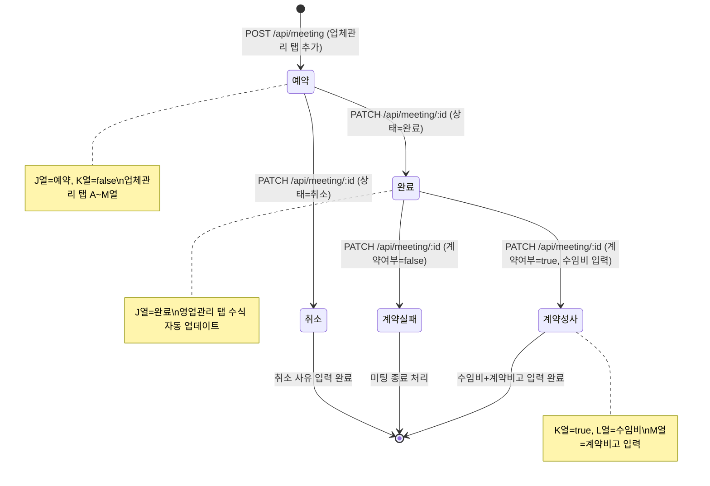
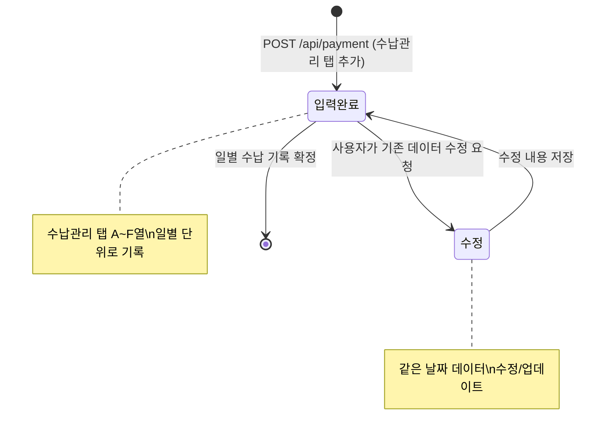
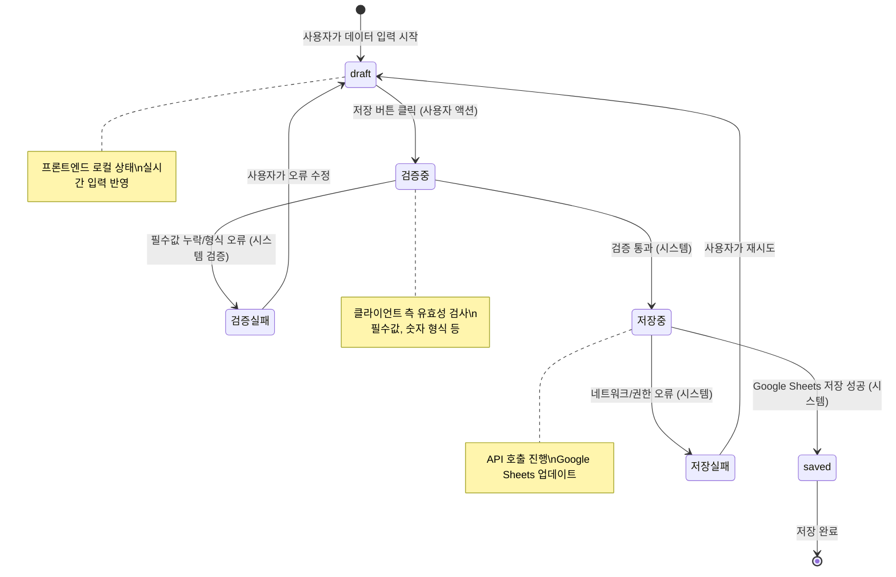
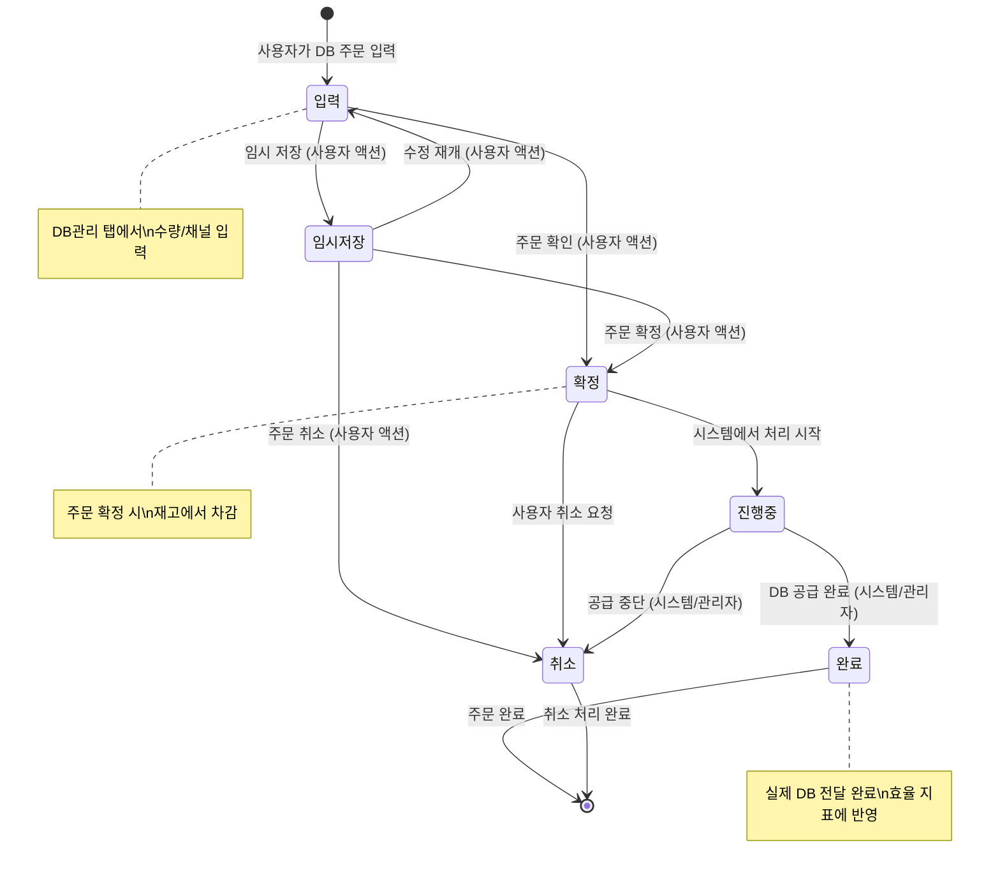

> **📄 이 문서는 무엇인가요?**
> - **한 줄 요약**: 세일즈PT 영업일지 시스템의 핵심 엔티티 상태 전이 다이어그램
> - **누가 읽나요**: 개발자
> - **어떤 기능·작업과 연결?**: 비즈니스 로직 구현, 상태 관리, API 설계
> - **읽고 나면 알 수 있는 것**:
>   - Meeting, Payment, DailyEntry, DBOrder 각 엔티티의 상태 흐름
>   - 상태 전이를 트리거하는 사용자 액션과 시스템 이벤트
> - **관련 문서**: [ER 다이어그램](./er-diagram.md), [데이터 모델](./data-model.md), [API 명세](./api-spec.md)

# 상태 전이 다이어그램

## 1. Meeting 상태 전이 (ADR-0003 업데이트)

### Meeting 필드별 상태 변화
- **예약 단계**: A~I열 입력, J=예약, K=false, L=0, M=빈값
- **완료 단계**: J=완료 (K, L, M 유지)
- **계약성사**: J=완료, K=true, L=수임비, M=계약비고
- **계약실패**: J=완료, K=false (L, M 변경 없음)
- **취소**: J=취소, 나머지 필드 유지

## 2. Payment 상태 전이 (ADR-0003 업데이트)

### Payment 단순 상태 모델 (ADR-0003)
Payment는 Meeting과 달리 **단순 입력 모델**을 따름:
- **독립성**: Meeting과 별개의 워크플로우
- **일별 기록**: 1행 = 1일 수납 기록
- **상태 없음**: 복잡한 승인/수납 상태 전이 대신 단순 CRUD
- **필드**: A(id), B(수납날짜), C(승인건수), D(수납건수), E(수납금액), F(기관비고)

## 3. DailyEntry 저장 상태 전이

## 4. DBOrder 상태 전이

## 상태 전이 트리거 요약

### 사용자 액션 트리거 (ADR-0003 업데이트)
- **Meeting**: 미팅 예약 생성(POST), 상태 변경(PATCH), 계약 정보 입력
- **Payment**: 수납 데이터 입력(POST), 기존 데이터 수정
- **DailyEntry**: 컨택 데이터 입력, 특이사항 입력, 저장 요청
- **DBOrder**: 주문 입력, 확정 처리, 취소 요청

### 시스템 이벤트 트리거 (ADR-0003 업데이트)
- **Meeting**: 업체관리 탭 → 영업관리 탭 시트 수식 자동 집계
- **Payment**: 수납관리 탭 → 영업관리 탭 시트 수식 자동 집계
- **DailyEntry**: 클라이언트 검증, API 응답, 시트 저장 완료
- **DBOrder**: 재고 관리 시스템, 관리자 처리

### 상태 전이 제약 조건 (ADR-0003 업데이트)
1. **Meeting**: 
   - 예약 → 완료: 미팅날짜/시간 검증
   - 완료 → 계약성사: 수임비 > 0, 계약비고 필수
   - 같은 업체명+미팅날짜 중복 허용 (업체 마스터 없음)
2. **Payment**: 
   - 승인건수 ≥ 수납건수 (승인 후 입금)
   - 수납금액 > 0
   - 하루 1개 기록만 허용 (수정으로 처리)
3. **DailyEntry**: 
   - 필수 필드: date, channels (4개 채널 전체)
   - 채널별 생산 ≥ 유입 ≥ 컨택진행 ≥ 컨택성공 (퍼널 순서)
4. **DBOrder**: 재고 수량 확인 후 확정 처리 (기존 유지)