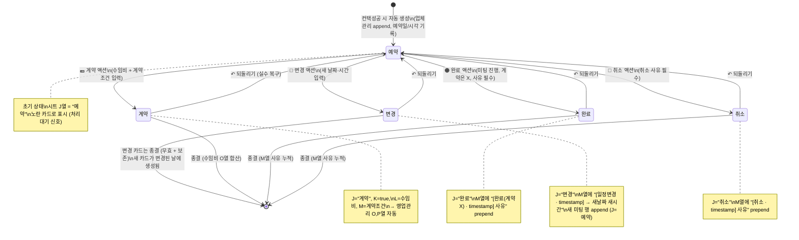
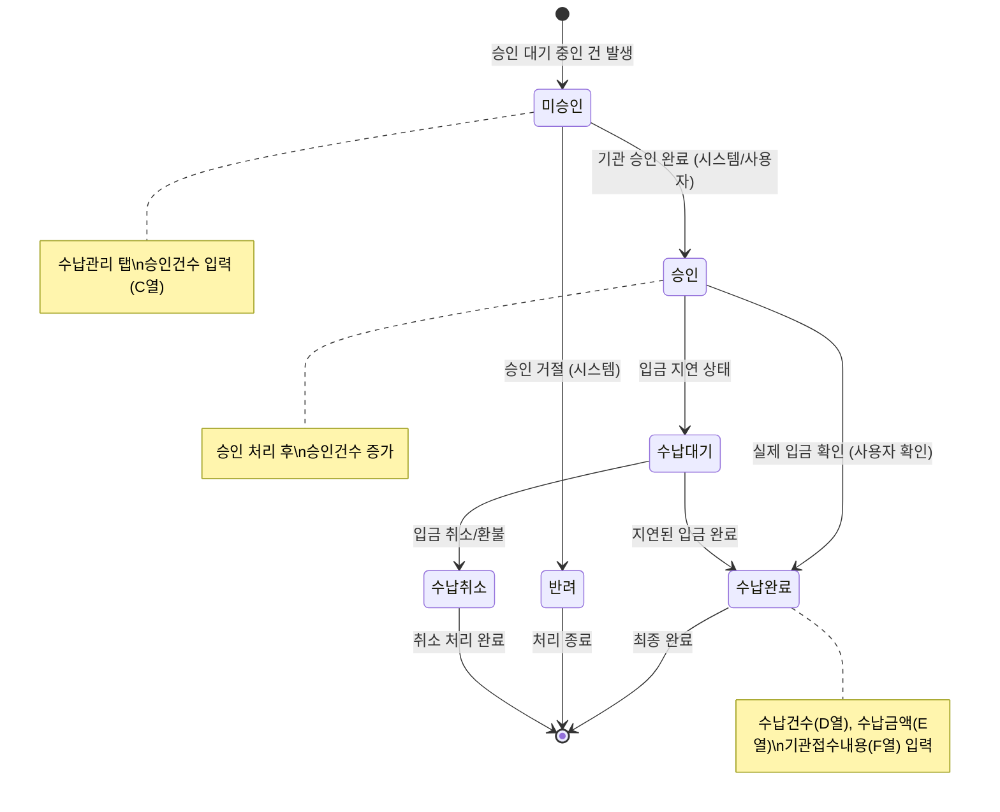
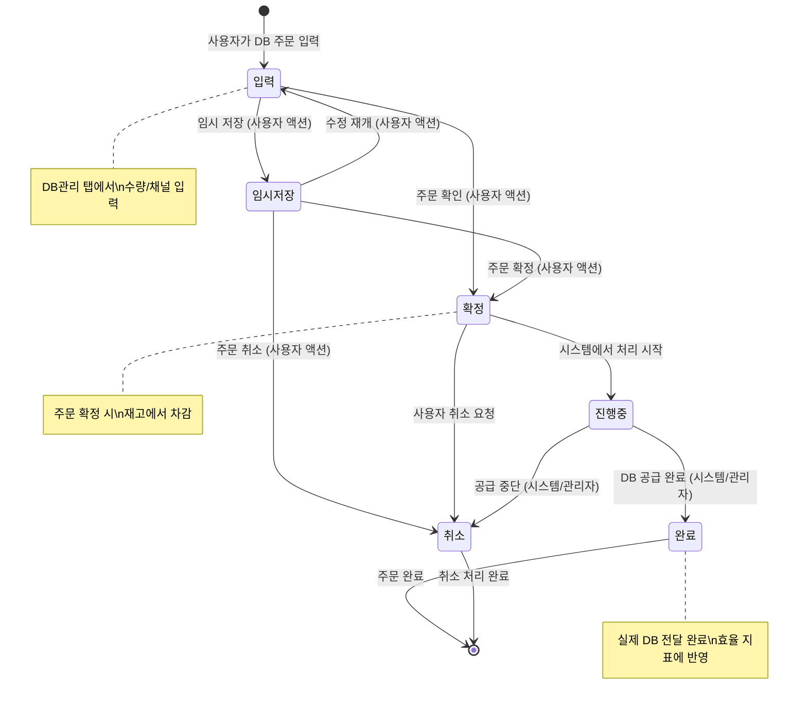

> **📄 이 문서는 무엇인가요?**
> - **한 줄 요약**: 세일즈PT 영업일지 시스템의 핵심 엔티티 상태 전이 다이어그램
> - **누가 읽나요**: 개발자
> - **어떤 기능·작업과 연결?**: 비즈니스 로직 구현, 상태 관리, API 설계
> - **읽고 나면 알 수 있는 것**:
>   - Meeting, Payment, DailyEntry, DBOrder 각 엔티티의 상태 흐름
>   - 상태 전이를 트리거하는 사용자 액션과 시스템 이벤트
> - **관련 문서**: [ER 다이어그램](./er-diagram.md), [데이터 모델](./data-model.md), [API 명세](./api-spec.md)

# 상태 전이 다이어그램

## 1. Meeting 상태 전이 (5상태) ⭐

> 일정·계약 탭 시안 v2 기준. 시트 J열에 저장되는 상태값은: `예약 | 완료 | 계약 | 변경 | 취소` (5종).

### 5상태 비교 표

| 상태 | 시트 J열 | 카드 색 | 다음 액션 가능 | 종결 여부 |
|---|---|---|---|---|
| 예약 (reserved) | `"예약"` | 🟡 노랑 | 4가지 액션 (계약/완료/변경/취소) | ❌ 처리 대기 |
| 계약 (contract) | `"계약"` | 💵 진초록 | 수임비/조건 수정, 예약으로 되돌리기 | ✅ |
| 완료 (done) | `"완료"` | 🟠 주황 | 사유 추가, 예약으로 되돌리기 | ✅ |
| 변경 (rescheduled) | `"변경"` | 📅 보라 | 예약으로 되돌리기 (새 카드는 별도) | ✅ |
| 취소 (canceled) | `"취소"` | 🔴 빨강 | 사유 수정, 예약으로 되돌리기 | ✅ |

### 핵심 규칙
1. **변경**은 단순 상태 전환이 아니라 **새 미팅 행 자동 생성** + 기존 행은 변경 상태로 보존 (이력 추적)
2. 모든 종결 상태 → 예약으로 **되돌리기** 가능 (실수 복구 안전망)
3. **미팅결과(M열)**는 prepend 누적 (최신 위) → 한 미팅의 변경 이력을 시간순 역방향으로 추적

## 2. Payment 상태 전이

## 3. DailyEntry 저장 상태 전이

## 4. DBOrder 상태 전이

## 상태 전이 트리거 요약

### 사용자 액션 트리거
- **Meeting**: 예약 생성, 완료 처리, 계약 입력, 취소 요청
- **Payment**: 승인건수 입력, 수납 확인, 금액 입력
- **DailyEntry**: 데이터 입력, 저장 요청, 오류 수정
- **DBOrder**: 주문 입력, 확정 처리, 취소 요청

### 시스템 이벤트 트리거
- **Meeting**: 업체관리 → 영업관리 수식 집계 (TEXTJOIN, COUNTIFS)
- **Payment**: 수납관리 → 영업관리 수식 집계 (SUMIFS), 기관 연동 (승인/반려)
- **DailyEntry**: 클라이언트 검증, API 응답
- **DBOrder**: 재고 관리 시스템, 관리자 처리

### 상태 전이 제약 조건
1. **Meeting**: 예약 → 완료 전환 시 미팅날짜/미팅시간 검증 필수
2. **Payment**: 승인 → 수납완료 시 금액 일치성 검증, 수납날짜 유효성
3. **DailyEntry**: 필수 필드 (date, channels) 검증, 영업관리 E~H,M 열만 쓰기
4. **DBOrder**: 재고 수량 확인 후 확정 처리

### 새로운 제약 조건 (ADR-0003)
1. **영업관리 I~L, N~T 수식 컬럼**: 웹에서 직접 쓰기 시도 시 400 에러
2. **예약일 vs 미팅날짜**: 예약일(생산 지표) ≠ 미팅날짜(컨택 지표) 구분 강제
3. **표시문자열 수식**: N열(날짜 포함), O열(날짜 제외) 자동 생성만