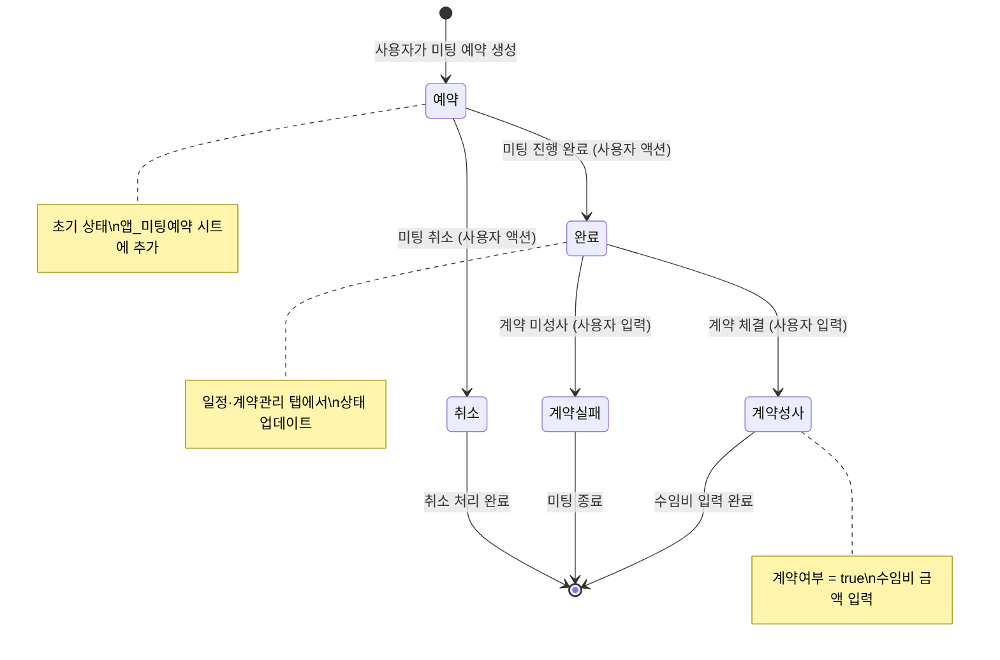
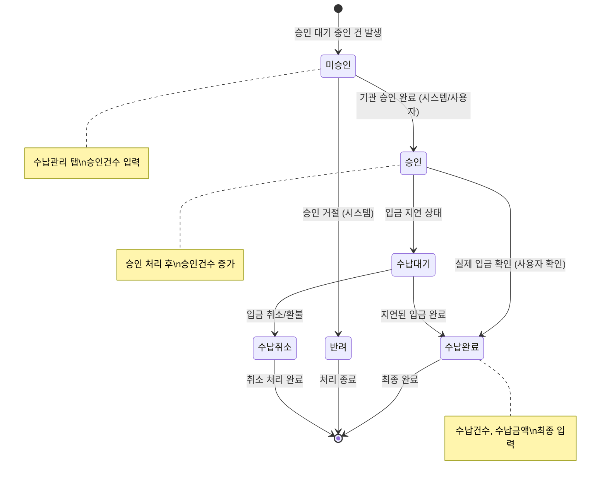
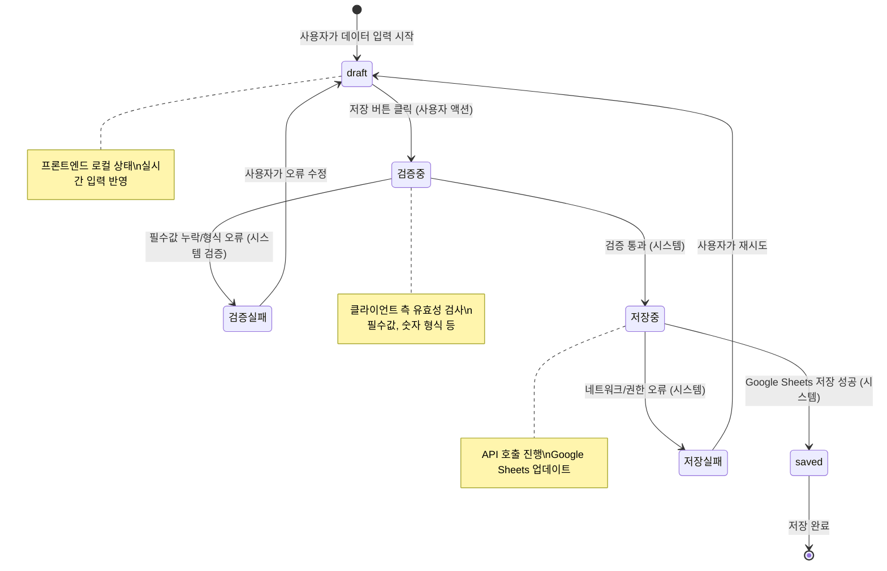
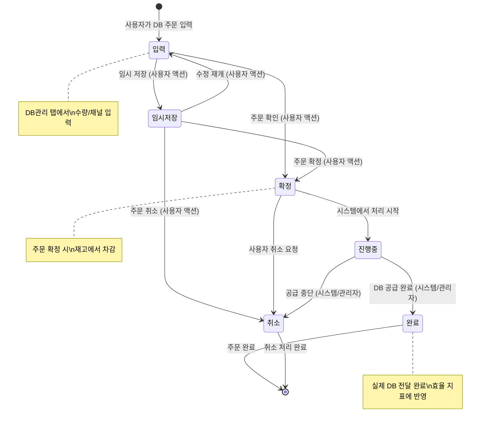

> **📄 이 문서는 무엇인가요?**
> - **한 줄 요약**: 세일즈PT 영업일지 시스템의 핵심 엔티티 상태 전이 다이어그램
> - **누가 읽나요**: 개발자
> - **어떤 기능·작업과 연결?**: 비즈니스 로직 구현, 상태 관리, API 설계
> - **읽고 나면 알 수 있는 것**:
>   - Meeting, Payment, DailyEntry, DBOrder 각 엔티티의 상태 흐름
>   - 상태 전이를 트리거하는 사용자 액션과 시스템 이벤트
> - **관련 문서**: [ER 다이어그램](./er-diagram.md), [데이터 모델](./data-model.md), [API 명세](./api-spec.md)

# 상태 전이 다이어그램

## 1. Meeting 상태 전이

## 2. Payment 상태 전이

## 3. DailyEntry 저장 상태 전이

## 4. DBOrder 상태 전이

## 상태 전이 트리거 요약

### 사용자 액션 트리거
- **Meeting**: 예약 생성, 완료 처리, 계약 입력, 취소 요청
- **Payment**: 승인건수 입력, 수납 확인, 금액 입력
- **DailyEntry**: 데이터 입력, 저장 요청, 오류 수정
- **DBOrder**: 주문 입력, 확정 처리, 취소 요청

### 시스템 이벤트 트리거
- **Meeting**: Google Sheets 자동 집계 (TEXTJOIN)
- **Payment**: 기관 시스템 연동 (승인/반려)
- **DailyEntry**: 클라이언트 검증, API 응답
- **DBOrder**: 재고 관리 시스템, 관리자 처리

### 상태 전이 제약 조건
1. **Meeting**: 예약 → 완료 전환 시 date/time 검증 필수
2. **Payment**: 승인 → 수납완료 시 금액 일치성 검증
3. **DailyEntry**: 필수 필드 (date, channels) 검증
4. **DBOrder**: 재고 수량 확인 후 확정 처리