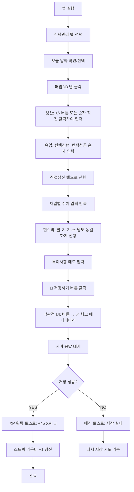
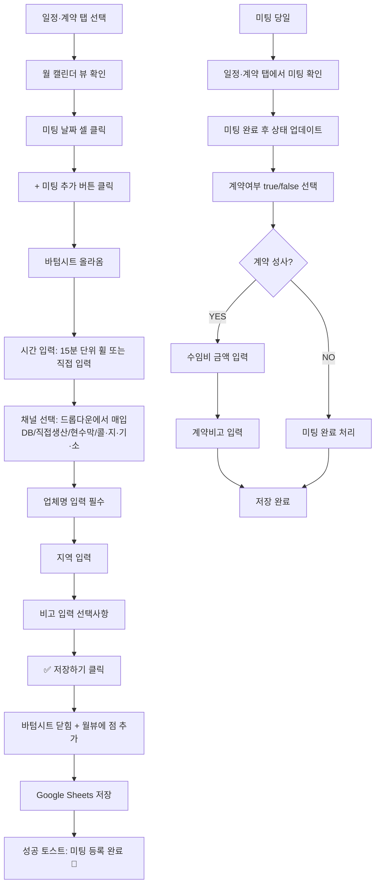
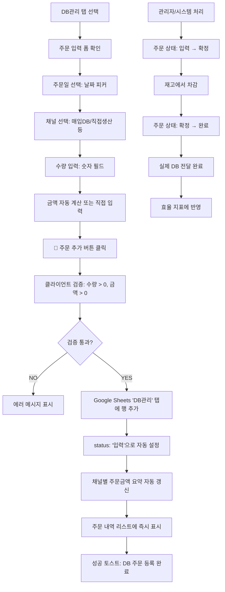
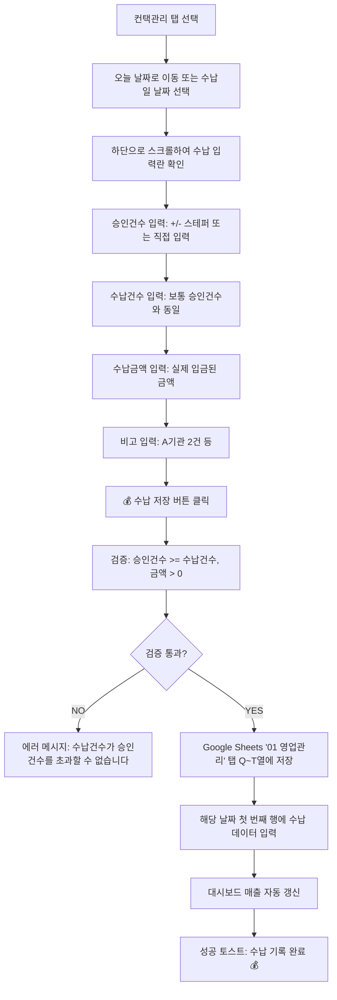

> **📄 이 문서는 무엇인가요?**
> - **한 줄 요약**: 세일즈PT 영업일지 앱의 6개 핵심 사용자 시나리오와 각 단계별 상호작용 플로우
> - **누가 읽나요**: 개발자, 기획자, UX 설계자
> - **어떤 기능·작업과 연결?**: 프론트엔드 구현, API 설계, 사용자 테스트, 버그 픽스
> - **읽고 나면 알 수 있는 것**: 
>   - 사용자가 각 기능을 어떻게 사용하는지
>   - 각 단계에서 어떤 버튼/탭을 클릭하는지
>   - 실패 상황에서 어떤 에러가 발생하는지
> - **관련 문서**: [ER 다이어그램](./er-diagram.md), [상태 전이도](./state-machines.md), [API 명세](./api-spec.md), [스토리보드](./storyboard-mvp.md)

# 사용자 여정 (User Journeys)

## 시나리오 1: 오늘 영업 기록 (하루 마감)

- **페르소나**: 이수강 (PRM 5기 수강생)
- **트리거**: 하루 영업 활동이 끝나고 집에 돌아와 스마트폰으로 오늘 성과를 기록하려 함
- **목표**: 4개 채널별로 생산/유입/컨택진행/컨택성공 수치를 입력하고 저장
- **성공 기준**: Google Sheets '01 영업관리' 탭에 오늘 날짜로 4행이 저장되고, XP 획득 토스트가 표시됨

**단계 (Mermaid flowchart)**:


**엣지 케이스**:
1. **검증 실패**: 컨택성공 > 컨택진행인 경우 → 경고 표시, 저장 불가
2. **네트워크 오류**: 저장 중 인터넷 끊김 → "인터넷 연결을 확인해주세요" 토스트
3. **이미 저장된 날짜**: 같은 날짜 재저장 시도 → 기존 데이터 덮어쓰기 확인 모달

---

## 시나리오 2: 미팅 예약 + 결과 기록

- **페르소나**: 이수강 (PRM 5기 수강생)
- **트리거**: 컨택성공으로 미팅 약속을 잡았고, 바로 캘린더에 등록하고 싶음
- **목표**: 미팅 일정을 앱에 등록하고, 미팅 후 계약 결과 기록 (Google Calendar 동기화는 향후 확장 기능)
- **성공 기준**: Google Sheets '앱_미팅예약' 탭에 미팅이 등록됨

**단계 (Mermaid flowchart)**:


**엣지 케이스**:
1. **중복 미팅**: 같은 날짜+시간+업체명 → MVP에서는 허용하지만 향후 경고 예정
2. **수임비 누락**: 계약=true인데 수임비=0 → "계약 시 수임비를 입력해주세요" 검증 에러
3. **네트워크 오류**: 저장 중 연결 끊김 → "다시 시도해주세요" 토스트 표시

---

## 시나리오 3: DB 구매 입력

- **페르소나**: 이수강 (PRM 5기 수강생)
- **트리거**: DB 업체에서 매입DB를 주문했고 비용과 수량을 기록하고 싶음
- **목표**: DB 주문 내역을 입력하고 채널별 총비용 자동 반영 확인
- **성공 기준**: Google Sheets 'DB관리' 탭에 주문이 추가되고, 채널별 효율 지표에 반영됨

**단계 (Mermaid flowchart)**:


**엣지 케이스**:
1. **중복 주문**: 같은 업체·금액·날짜가 이미 있음 → "중복 주문입니다. 계속하시겠습니까?" 확인 모달
2. **음수 입력**: 수량이나 금액에 음수 → "양수를 입력해주세요" 검증 에러
3. **재고 부족**: 주문 확정 시 재고 부족 → 관리자가 처리하는 백엔드 이슈

---

## 시나리오 4: 수납 기록

- **페르소나**: 이수강 (PRM 5기 수강생)
- **트리거**: 계약 완료 후 며칠 뒤 기관에서 승인이 나고 수납이 완료됨
- **목표**: 승인건수, 수납건수, 수납금액을 입력하여 매출 기록 완료
- **성공 기준**: Google Sheets '01 영업관리' 탭 Q~T열에 수납 데이터가 저장됨

**단계 (Mermaid flowchart)**:


**엣지 케이스**:
1. **수납건수 > 승인건수**: 논리적 모순 → "수납건수가 승인건수를 초과할 수 없습니다" 에러
2. **수납금액 0원**: 수납건수는 있는데 금액이 0 → "수납 금액을 확인해주세요" 경고
3. **과거 날짜 수정**: 이미 기록된 수납 데이터 수정 → 기존 값 표시 후 덮어쓰기

---

## 시나리오 5: 주간 회고 (대시보드 보기)

- **페르소나**: 이수강 (PRM 5기 수강생) / 김트레이너 (운영진)
- **트리거**: 주말이나 월요일 아침에 지난주 성과를 돌아보고 이번주 목표를 세우려 함
- **목표**: 주차별 이동하며 퍼널 효율과 스킬 점수를 확인하고 개선점 파악
- **성공 기준**: 대시보드에서 주간별 데이터를 확인하고 트렌드 분석

**단계 (Mermaid flowchart)**:
```mermaid
flowchart TD
    A[앱 실행] --> B[대시보드 탭 기본 선택]
    B --> C[현재 주차 및 D-day 확인]
    C --> D[주간 활동 추이 차트 확인]
    D --> E[◀▶ 버튼으로 주차 이동]
    E --> F[4대 지표 카드: 생산/컨택/미팅/계약 수치 확인]
    F --> G[이번주 vs 지난주 증감 비교]
    G --> H[오늘의 미팅 일정 미리보기]
    H --> I[채널별 효율 지표 확인]
    I --> J[매입DB vs 직접생산 vs 현수막 vs 콜·지·기·소 비교]
    J --> K[영업효율 퍼널 분석]
    K --> L[컨택→일정: 75.2%]
    L --> M[일정→미팅: 80.1%]
    M --> N[미팅→계약: 60.5%]
    N --> O[컨택→계약: 45.8%]
    O --> P[개선이 필요한 구간 파악]
    P --> Q[다음주 목표 수립 (앱 외부 활동)]
```

**엣지 케이스**:
1. **수강 시작 전**: 수강 시작 전 날짜 접근 → "아직 수강이 시작되지 않았습니다" 배너 표시
2. **데이터 없는 주차**: 해당 주에 아무런 활동이 없음 → 0으로 표시하되 "활동 기록이 없습니다" 안내
3. **수료 후 접근**: 수료일 이후 → 읽기 전용 모드, "수료를 축하합니다! 🎉" 배너

---

## 시나리오 6: 주말 복구 (놓친 날 입력)

- **페르소나**: 이수강 (PRM 5기 수강생)
- **트리거**: 평일에 바빠서 기록을 못했고, 주말에 한꺼번에 지난주 데이터를 입력하려 함
- **목표**: 과거 날짜로 이동해서 놓친 날들의 영업 기록을 소급 입력
- **성공 기준**: 과거 날짜에 데이터가 정상적으로 저장되고 XP는 현재 기준으로 획득

**단계 (Mermaid flowchart)**:
```mermaid
flowchart TD
    A[컨택관리 탭 선택] --> B[현재 날짜에서 ◀ 버튼으로 과거 날짜 이동]
    B --> C[놓친 날짜 선택: 예) 4월 18일]
    C --> D[해당 날짜가 비어있음을 확인]
    D --> E[채널별 데이터 입력 시작]
    E --> F[기억나는 대로 생산/유입/컨택진행/컨택성공 입력]
    F --> G[특이사항에 소급 입력임을 메모]
    G --> H[💾 저장하기 클릭]
    H --> I[과거 날짜이지만 정상 저장]
    I --> J[XP 획득: 현재 날짜 기준으로 +45 XP]
    J --> K[스트릭 카운터는 현재 연속 기록만 반영]
    K --> L[다음 날짜로 이동하여 반복]
    L --> M[4월 19일도 동일하게 처리]
    M --> N[현재 날짜까지 복구 완료]
    N --> O[대시보드에서 전체 주간 데이터 재확인]
```

**엣지 케이스**:
1. **수강 전 날짜 입력**: 수강 시작일 이전 → "수강 시작 전입니다" 에러, 입력 불가
2. **미래 날짜 입력**: 오늘 이후 날짜 → "미래 날짜는 입력할 수 없습니다" 에러
3. **이미 있는 날짜 수정**: 기존 데이터 있음 → "기존 데이터를 덮어쓰시겠습니까?" 확인 모달
4. **과도한 소급 입력**: 한 번에 너무 많은 날짜 입력 시 → 정상 처리하되 "소급 입력이 많습니다. 정확한 데이터인지 확인해주세요" 안내

---

## 공통 패턴 및 인터랙션 원칙

### 1. 낙관적 UI (Optimistic UI)
- 모든 저장 액션에서 즉시 UI 업데이트
- 서버 응답 실패 시에만 롤백
- 사용자는 빠른 피드백을 받아 만족도 향상

### 2. 에러 처리 일관성
- 토스트 메시지로 통일된 피드백
- 성공: 초록색 체크 + 구체적 메시지
- 경고: 노란색 + 해결 방법 안내
- 에러: 빨간색 + 재시도 방법 제시

### 3. 입력 편의성
- 숫자 입력: +/- 스테퍼 + 직접 입력 병행
- 드롭다운: 자주 쓰는 옵션 상단 고정
- 자동 포커스: 다음 입력 필드로 자동 이동

### 4. 상태 동기화
- Google Sheets = SSOT (Single Source of Truth)
- 앱은 읽기/쓰기 전용, 복잡한 계산은 시트 수식에 위임
- 외부 API 연동(Google Calendar 등)은 향후 확장 기능으로 예정

---

## 향후 확장 기능

### Google Calendar 동기화
- **기능**: 미팅 등록 시 자동으로 Google Calendar에 이벤트 생성
- **구현 방향**: 
  - Google Calendar API를 통한 이벤트 생성/수정/삭제
  - 시트 저장 성공 후 Calendar API 호출 (실패해도 핵심 기능은 동작)
  - 캘린더 동기화 실패 시 경고 토스트 표시
- **우선순위**: P2 (MVP 이후 검토)